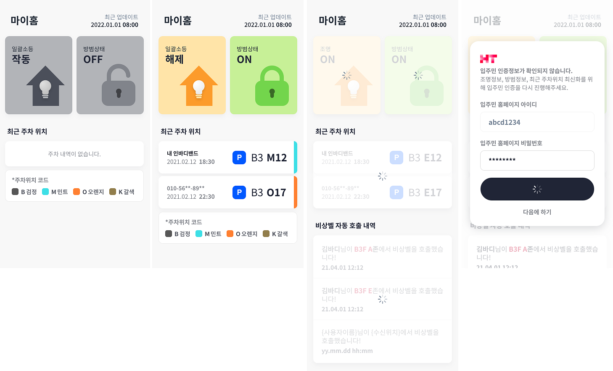
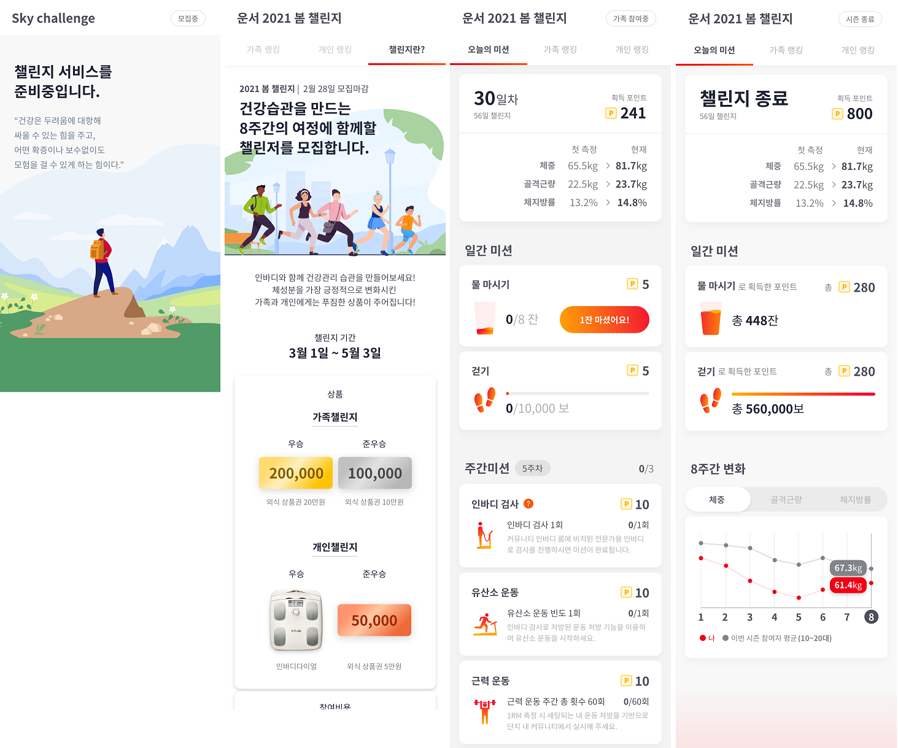

# SK VIEW 헬스케어
> 보안상 코드는 업로드가 불가하여, 이미지로 대체. 
> AOS, IOS 앱 다운로드 가능
---

- ### 목차

**[1. 프로젝트 정보](#1-프로젝트-정보)**

**[2. 주요기능 및 스크린샷](#2-주요기능-및-스크린샷)**

---

## 1. 프로젝트 정보

**프로젝트기간** **:**
- 2021.10 ~ 2021.12

**팀 구성원** **:**
- 총 5명
  - Front-end : 1명
  - Back-end & Server : 2명 
  - AOS : 1명
  - IOS : 1명

**사용 언어 및 툴** **:** 
- HTML
- CSS
- Vanilla JS
- Razor
- C#
- Visual Studio

**목적** **:** 
- SK View 입주민의 건강 관리를 위한 프리미엄 서비스

## 2. 주요기능 및 스크린샷

> 외출 시 소등 상태와 방범 상태를 확인 할 수 있다. 
> 주차한 위치도 확인이 가능하다.
> 일괄소등, 방범상태, 최근 주차 위치의 정보가 개별로 들어오기 때문에, 비동기 처리로 개발했다. ( Promise, then 사용 )

---

> 챌린지는 8주간 진행하고, 개인 혹은 가족으로 참여가 가능하다. 
> 일간 미션과 주간 미션을 클리어하면 포인트를 얻을 수 있고, 얻은 포인트의 양으로 본인 혹은 가족의 랭킹을 확인할 수 있다. 
> 물 마시기 미션은 어뷰징을 방지하기 위해 '1잔 마셨어요' 버튼을 누른 후 30분의 쿨타임이 발생한다. 
> 8주간 본인의 체중, 골격근량, 체지방률의 변화를 보다 쉽게 확인할 수 있게 그래프 보여준다. 
> *그래프는 전부 svg를 사용하여 개발했다.

